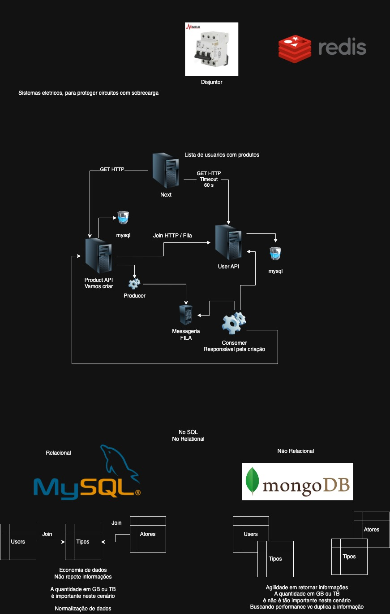

# ConsumerProductUserService

Projeto base para consumo de mensagens Kafka e integração entre microserviços de usuários e produtos usando Java Spring Boot.

## 📚 Descrição
Este microserviço consome mensagens de um tópico Kafka, processa os dados recebidos (produto + usuário), cria o usuário via API, e em seguida cria o produto associado ao usuário, também via API. O serviço é resiliente: se as APIs estiverem fora do ar, ele tentará novamente até o sucesso ou até o limite de tentativas.

## 🚀 Tecnologias
- Java 17+
- Spring Boot 3
- Spring Kafka
- Maven
- Docker (para Kafka)

## ⚙️ Requisitos
- Java 17 ou superior
- Maven
- Kafka rodando (pode ser via Docker)
- APIs de usuários e produtos rodando

## 🐳 Subindo o Kafka com Docker
Exemplo de comando para subir Kafka e Zookeeper:
```sh
docker run -d --name zookeeper -p 2181:2181 confluentinc/cp-zookeeper:7.5.0

docker run -d --name kafka -p 9092:9092 \
  -e KAFKA_ZOOKEEPER_CONNECT=zookeeper:2181 \
  -e KAFKA_ADVERTISED_LISTENERS=PLAINTEXT://localhost:9092 \
  -e KAFKA_OFFSETS_TOPIC_REPLICATION_FACTOR=1 \
  --link zookeeper:zookeeper \
  confluentinc/cp-kafka:7.5.0
```

## 🔧 Configuração
O arquivo `src/main/resources/application.yml` centraliza as configurações:

- URLs das APIs, tópico e groupId do Kafka podem ser sobrescritos por variáveis de ambiente:
  - `USER_API_URL` — URL da API de usuários (default: http://localhost:8080/users)
  - `PRODUCT_API_URL` — URL da API de produtos (default: http://localhost:8081/products)
  - `KAFKA_TOPIC` — Nome do tópico Kafka (default: product-user-topic)
  - `KAFKA_GROUP_ID` — GroupId do consumidor Kafka (default: consumer-product-user-service-group)
- O serviço espera Kafka em `localhost:9092` (ajuste se necessário).
- O serviço roda na porta 8082 por padrão.

## 🏗️ Estrutura do Projeto
```
src/main/java/com/consumerservice/
  config/
  dtos/
  kafka/
  model_views/
  ConsumerProductUserServiceApplication.java
src/main/resources/
  application.yml
clear-kafka-topic.sh
run.sh
```

## 🏃‍♂️ Rodando o Projeto
1. Clone o repositório
2. Suba o Kafka (veja acima)
3. Garanta que as APIs de usuários e produtos estejam rodando
4. Execute:
   ```sh
   mvn clean install
   mvn spring-boot:run
   # ou
   ./run.sh
   ```

## 📦 Exemplo de Payload Kafka
Mensagem que deve ser publicada no tópico Kafka:
```json
{
  "name": "Produto XPTO do Licon",
  "description": "Teste",
  "price": 149.99,
  "quantity": 20,
  "userName": "Licon",
  "userEmail": "Licon@teste.com"
}
```

## 🔄 Fluxo da Aplicação
1. O consumidor lê a mensagem do Kafka.
2. Cria o usuário na API de usuários (`POST /users`).
3. Usa o ID retornado para criar o produto na API de produtos (`POST /products`).
4. Se qualquer etapa falhar, tenta novamente (com 10s de espera) até 100 vezes.
5. O offset Kafka só é commitado após sucesso total do processamento.

## 🧹 Limpar mensagens do Kafka
Use o script `clear-kafka-topic.sh` para limpar todas as mensagens do tópico:
```sh
chmod +x clear-kafka-topic.sh
./clear-kafka-topic.sh
```

## 📖 Exemplos de Endpoints das APIs
- `POST /users` — Cria um novo usuário
  - Body:
    ```json
    {
      "name": "Danilo",
      "email": "danilo@teste.com"
    }
    ```
- `POST /products` — Cria um novo produto associado a um usuário
  - Body:
    ```json
    {
      "name": "Produto XPTO",
      "description": "Teste",
      "price": 149.99,
      "quantity": 20,
      "userId": 1
    }
    ```

## ℹ️ Observações
- O serviço não expõe endpoints HTTP, é apenas um consumidor/processador.
- O retry/backoff é configurado para 100 tentativas com 10 segundos de espera entre elas.
- O commit do offset Kafka só ocorre após sucesso total do processamento.
- As URLs das APIs, tópico e groupId podem ser alterados via variáveis de ambiente.

---

